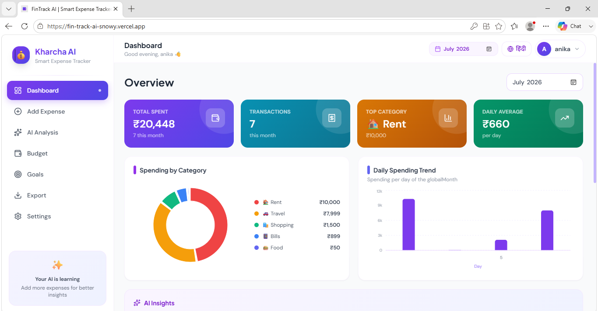
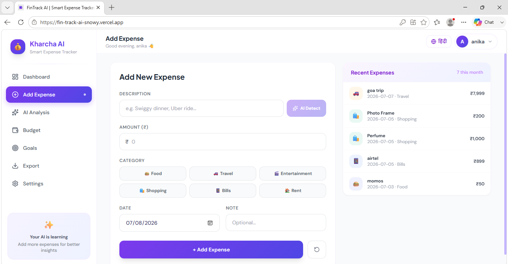
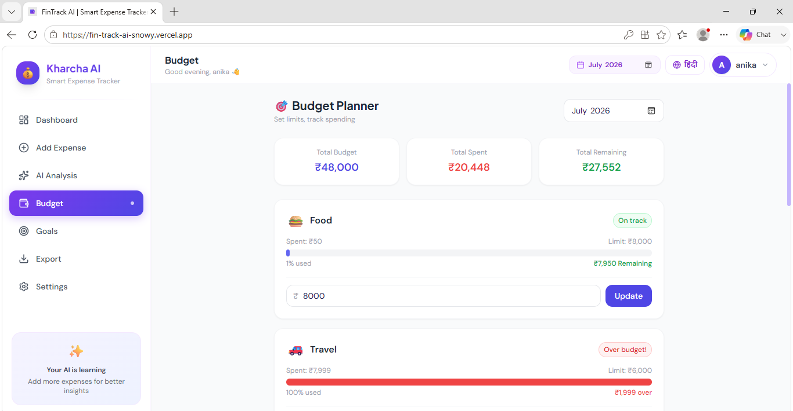
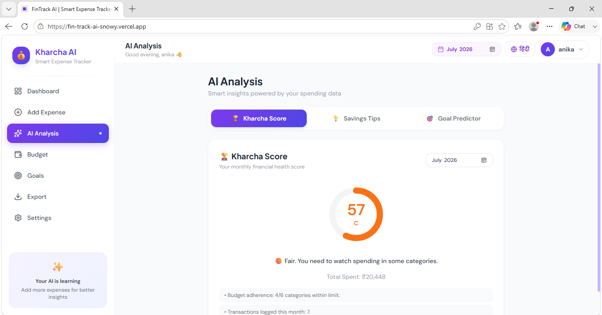
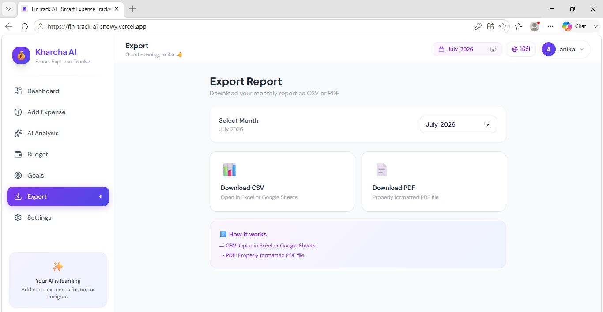

# 💰 FinTrack AI (Kharcha AI)

### 🤖 AI-Powered Personal Finance & Expense Tracking Platform

Track • Analyze • Budget • Save Smarter

**Live Demo:** https://fin-track-ai-snowy.vercel.app/

------------------------------------------------------------------------

## 📖 Overview

FinTrack AI (Kharcha AI) is a full-stack AI-powered expense management
application designed to help users gain better control over their
finances. Beyond traditional expense tracking, it provides intelligent
spending analysis, financial health scoring, smart saving
recommendations, budget planning, goal prediction, multilingual support,
and downloadable reports.

The project combines **React**, **FastAPI**, and **Machine Learning** to
transform raw spending data into actionable insights.

------------------------------------------------------------------------

# ✨ Core Features

### 📊 Interactive Dashboard

-   Monthly spending overview
-   Daily spending trends
-   Category-wise analytics
-   Quick financial summary cards

### 💸 Expense Management

-   Add, edit and organize expenses
-   AI-assisted expense categorization
-   Category filters
-   Recent transaction history

### 🤖 AI Financial Insights

-   Kharcha Score (Financial Health)
-   Spending pattern analysis
-   Personalized saving tips
-   Goal prediction

### 🎯 Budget Planner

-   Category-wise budget limits
-   Remaining budget tracker
-   Over-budget alerts
-   Monthly planning

### 📄 Export & Reports

-   Export reports to CSV
-   Export reports to PDF
-   Monthly summaries

### 🌍 User Experience

-   Responsive UI
-   Hindi & English support
-   Modern dashboard
-   Clean component-based architecture

------------------------------------------------------------------------

# 🖼 Screenshots

> Create an **assets/** folder in the repository and add these images.

  Page             Preview
  ---------------- -----------------------------
  Dashboard        
  Add Expense      
  Budget Planner   
  AI Analysis      
  Export Reports   

------------------------------------------------------------------------

# 🏗 Architecture

``` text
                    User
                     │
                     ▼
          React + Vite Frontend
                     │
          REST API Communication
                     │
                     ▼
             FastAPI Backend
                     │
      ┌──────────────┴──────────────┐
      ▼                             ▼
 SQLite Database         Machine Learning Models
      │                             │
      └──────────────┬──────────────┘
                     ▼
          AI Insights & Predictions
```

------------------------------------------------------------------------

# 🛠 Tech Stack

  Layer              Technology
  ------------------ ------------------
  Frontend           React.js, Vite
  Backend            FastAPI (Python)
  Machine Learning   Scikit-learn
  Database           SQLite
  Charts             Recharts
  Styling            CSS3
  Deployment         Vercel + Render

------------------------------------------------------------------------

# 📂 Folder Structure

``` text
FinTrack-AI/
│
├── frontend/
│   ├── src/
│   ├── public/
│   ├── package.json
│   └── vite.config.js
│
├── backend/
│   ├── main.py
│   ├── models/
│   ├── database/
│   ├── requirements.txt
│   └── utils/
│
└── assets/
```

------------------------------------------------------------------------

# 🚀 Getting Started

## Clone Repository

``` bash
git clone https://github.com/anikagupta28/FinTrack-AI.git
cd FinTrack-AI
```

## Frontend

``` bash
cd frontend
npm install
npm run dev
```

## Backend

``` bash
cd backend
pip install -r requirements.txt
uvicorn main:app --reload
```

------------------------------------------------------------------------

# 🎯 Why FinTrack AI?

-   Uses AI instead of only storing expenses.
-   Generates actionable financial insights.
-   Encourages healthier spending habits.
-   Supports multilingual users.
-   Clean, modern UI built for real-world usability.

------------------------------------------------------------------------

# 🚀 Future Roadmap

-   OCR Receipt Scanner
-   Voice Expense Entry
-   Cloud Synchronization
-   Recurring Expense Detection
-   Investment Tracking
-   Mobile Application
-   AI Chat Financial Assistant

------------------------------------------------------------------------

# 👩‍💻 Author

**Anika Gupta**

B.Tech Information Technology

-   GitHub: https://github.com/anikagupta28
-   Project: https://github.com/anikagupta28/FinTrack-AI
-   Live Demo: https://fin-track-ai-snowy.vercel.app/

------------------------------------------------------------------------

# 🤝 Contributing

Contributions, feature suggestions, and improvements are welcome.

1.  Fork the repository
2.  Create a feature branch
3.  Commit your changes
4.  Open a Pull Request

------------------------------------------------------------------------

# ⭐ Support

If you like this project, consider giving it a **Star ⭐** on GitHub.

It helps the project reach more developers and motivates future
improvements.

------------------------------------------------------------------------

### 💜 Built with React, FastAPI & Machine Learning

**Designed & Developed by Anika Gupta**

